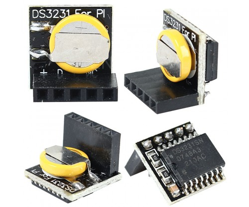
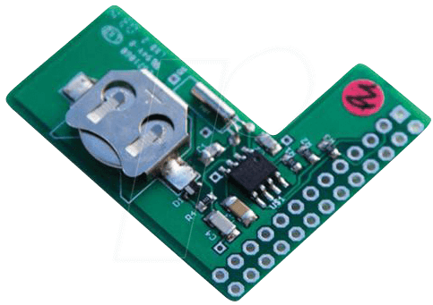

## Components compatible with Solo

* Need a fake list item for TOC:
{:toc}

Solo is versatile - many components are swappable for alternatives - options are listed below.

## Soundcards

The soundcard digitises the analog microphone signal into digital
data, which can then be (optionally modified in software and) stored
on the memory card.

<table class="tg">
  <tr>
    <th class="jc-title" colspan="6"> Sound Cards </th>
  </tr>
  
  <tr>
    <td class="jc-headers">name</td>
    <td class="jc-headers">connector</td>
    <td class="jc-headers">sample-rate</td>
    <td class="jc-headers">channels</td>
    <td class="jc-headers">cost</td>
    <td class="jc-headers">notes</td>
  </tr>
  
  <tr>
    <td class="jc-normalcell"><a href="https://us.creative.com/p/sound-cards/sound-blaster-play-3">SoundBlaster Play 3</a></td>
    <td class="jc-normalcell">USB</td>
    <td class="jc-normalcell">48,000Hz / 44100Hz natively</td>
    <td class="jc-normalcell">mono</td>
    <td class="jc-normalcell">£19.99 $24.99</td>
    <td class="jc-normalcell">This is the recommended soundcard for the Solo. Requires a standard analog microphone with 3.5mm jack</td>
  </tr>

  <tr>
    <td class="jc-normalcell"><a href="https://us.creative.com/p/sound-cards/sound-blaster-play-2">SoundBlaster Play 2</a></td>
    <td class="jc-normalcell">USB</td>
    <td class="jc-normalcell">native: 44,100Hz</td>
    <td class="jc-normalcell">mono</td>
    <td class="jc-normalcell">£19.99 $44.99</td> <td class="jc-normalcell">Older version of the SouldBlaster Play 3, Very similar to the newer version above.  Comes with a splitter cable which then offers a standard analog mic input socket (3.5mm).</td>
  </tr>

  <tr>
    <td class="jc-normalcell"><a href="http://www.bluemic.com/products/snowflake/">Blue Snowflake</a></td>
    <td class="jc-normalcell"> USB </td>
    <td class="jc-normalcell"> 44,100Hz </td>
    <td class="jc-normalcell"> mono </td>
    <td class="jc-normalcell">£?? $59.00</td>
    <td class="jc-normalcell">This is a soundcard with integrated microphone. It is possible to dismantle the stand to leave a spherical microphone, that sits well popping out of a UPVC plumbing waste pipe, which keeps the USB connector protected from the elements.  I also double protected them by disassembling and covering all the electronics in non-corrosive sillica, and they performed very well. Availability sporadic in UK.</td>
  </tr>
  
  <tr>
    <td class="jc-normalcell"><a href="http://www.dodotronic.com/ultramics/?v=79cba1185463">Dodotronic Ultramic 200/192</a></td>
    <td class="jc-normalcell">USB</td>
    <td class="jc-normalcell">192kHz (ultrasonic) </td>
    <td class="jc-normalcell">mono</td>
    <td class="jc-normalcell">200 Euros (!)</td>
    <td class="jc-normalcell">This is an ultrasonic microphone with
      integrated soundcard that records at 192kHz, for recording (e.g.)
      bats.</td>
  </tr>

  <tr>
    <td class="jc-normalcell">Cirrus Logic Audio Card (CLAC)</td>
    <td class="jc-normalcell">40-way header</td>
    <td class="jc-normalcell">192kHz</td>
    <td class="jc-normalcell">stereo</td>
    <td class="jc-normalcell">discontinued</td>
    <td class="jc-normalcell">The CLAC was the reccomended soundcard in 2016, but is no longer manufacturered.  But is still supported by Solo for existing users.</td>
  </tr>

</table>
&nbsp;

## Microphones

Some soundcards have integrated microphones (Blue Snowflake and
Dodotronic) so don't require a separate microphone. The SoundBlaster 2
and 3 soundcards, however, _do_ require a separate microphone.

The recommended microphone in the Solo:Basic is the Primo EM172
[(datasheet)](/lib/EM172.pdf) [Primo
website](http://www.primomic.com/).  Primo make a "capsule" which has
no connectors and needs soldered, but people like
[this](http://micbooster.com/) sell them (in the UK) with cables, and
nicely packaged ('Clippy') with windshelds, and will sell you a
matched pair if you want to do stereo recordings (be sure to choose a
soundcard that can handle stereo input, in this case).

Any microphone that offers a 3.5mm jack should work - including ones
like the [Sennheiser ME-66 microphone](http://en-uk.sennheiser.com/directional-microphone-shotgun-film-broadcast-me-66), which is directional, expensive and requires
an internal battery (that might run out), or really cheap "lavalier"
microphones if you don't care about sensitivity so much.

## Raspberry Pi

The recommended version is the [Raspberry Pi 1 model A+](https://www.raspberrypi.org/products/raspberry-pi-1-model/) because it consumes the lowest power and is cheap.

However, there are [many versions](https://www.raspberrypi.org/products/) of
the Raspberry Pi available, and they all work with Solo (except strange ones like the Compute Module).  If you are on utility/mains power (rather than batteries), then you can choose any version of the Raspberry Pi you like.  I have tested many configurations using Pi1-B+, Pi2 and Pi3, and they all work fine.

Note that the Raspberry Pi zero and zero-W require a USB adapter to be able
  to connect to normal USB soundcards/microphones.  When I bought my
  pi-zeros they came with such an adapter included, but you should
  check.  These 2 "zero" versions of the raspberry pi also lack "header pins"
  which are what the clock modules attach to. Again, my pi-zeros 
  arrived with separate header pins that I soldered on to the board 
  so I could then attach the clock module. But that's not for everyone. Other versions of the Pi don't have these quirks.

## Power Supplies

Solo takes it's power over a standard USB-micro cable. The recommended power supply for field use is a USB battery bank, but longer deployments can be achieved using larger (car/deep cycle) batteries.

The EC technology 24000mAh powerbank will power a Solo for around 5 days.

[ TODO - how to do a car battery.  Option of mains power too. ]

## Clock Modules (RTC)

Both of the clocks below are compatible with the Solo, and both are set in the same way.  Note that a Solo will run perfectly happily without a clock, except the system won't know the date or time, so the names of your audio files' will be meaningless. Both are "set" in the same way. (Learn how to [set a new clock](/documentation/clock.html).)

<table class="tg">
  <tr>
    <th class="jc-title" colspan="6"> Clock Modules </th>
  </tr>
  
  <tr>
    <td class="jc-headers">name</td>
    <td class="jc-headers">cost</td>
    <td class="jc-headers">notes</td>
    <td class="jc-headers">image</td>
  </tr>
  
  <tr>
    <td class="jc-normalcell"><a href="https://www.amazon.co.uk/s/ref=nb_sb_noss?field-keywords=DS3231+for+pi">DS3231</a></td>
    <td class="jc-normalcell"> cheap (<$10) </td>
    <td class="jc-normalcell">This clock is great - cheap and easy to install, and are widely manufactured - search for "DS3231 for pi". The down-side is that you can't change the battery, so once it's dead (after a year or two), you have to bin the whole module. Confusingly, sellers often list these modules as having no battery, when the _do_ infact have a battery included. Installation involves just pushing it onto the right pins of the Raspberry Pi.</td>
    <td class="jc-normalcell"></img></td>
  </tr>

  <tr>
    <td class="jc-normalcell"><a href="http://www.piface.org.uk/products/piface_clock/">PiFace shim RTC</a></td>
    <td class="jc-normalcell">£7.46</td>
    <td class="jc-normalcell">This clock has a changeable battery (which you must usually buy separately), and that battery is bigger than on the DS3231, so will last longer.  Installation involves sliding the battery into it's holder, and then pushing the module down onto the pins of the Raspberry Pi</td>
    <td class="jc-normalcell"></img></td>
  </tr>

</table>

&nbsp;

## Enclosures

[{:.some-css-class style="width:40%; margin: 10px; padding-bottom: 3px; float: right;"}](/img/solo-boxed.jpg)

The [DriBox](http://dri-box.com/) line of waterproof outdoor
enclosures are good - particularly version
[200](http://dri-box.com/size-option/size-200) since they have a good
system for the passage of cables from inside to outside.  It is
marketed for use for mains (utility) power in domestic gardens - for
things like christmas trees or water features. Thesy are [IP55
certified](https://en.wikipedia.org/wiki/IP_Code) and cheap.

The lid acts as an umbrella over the entire unit.  It has spongy seals
at each end of the box, which squeeze around the cables
making a good seal.

I also advise the use of an enclosure for the raspberry pi, mostly to
protect it from being bashed around in the main enclosure (in transit,
for example). A reasonable choice is [this
one](https://www.westonboxes.com/collections/business-card-boxes-1/products/deep-business-card-box)
costing less than a pound.

&nbsp;

## Miscellaneous Accessories

### Card extender - a flexible cable to keep the SD card further away from the raspberry pi.

The photo (click to enlarge) shows an "extension cable" for your micro
SD card.  This means all the fiddling with the memory card is now much
further away from the delicate electronics.  It costs a few pounds
from online sellers in China.

[{:.some-css-class style="width: 60%; border: 1px solid #e0e0e0; margin-left: 10px; float: right"}](/img/sdcard-extension-cable.jpg)

This would allow you to seal up the little box to keep the electronics
much safer.

This extender also changes the "format" of the card, from "micro SD"
to "SD", which I didn't really mean to do when I bought it, but I
realise it's a good thing.  I prefer the size of the SD-card (over the
SD micro size) when working outdoors.  Most of my micro SD cards were
supplied accompanied by one of the adapters (to make it into the
bigger SD size) - I show a few in the photo.

To use it: plug the extension into the Solo and then you don't go near
that end of it again.  All the activity happens at the nice big black
plastic SD-card holder on the other end, which can be 60cm away from
the electronics (cable lengths will vary).  You could velcro (blu-tac)
it to the side (or under the roof) of the big enclosure.

This is much more comfy to use in the field when you might have wet
slippery, dirty, muddy, cold, shaky hands.  And it's much better for
the electronics too - keeping them clean and dry and away from the
many dangers of human contact (water, dirt, shorting, static, physical
damage, etc).

If desired, you can now completely waterproof the "little box", and
never go into it again (except to change clock battery).  Add a pouch
of sillica-gel, and seal it up.  The box I normally recommend isn't
perfect in this situation, as it doesn't really fit well with the
extension plugged in.  Slight pressure on the lid is likely to
"unclick" the extension cable, so it's best to turn it to a different
orientation.  Or get a different "little box".

Search for "SD micro extension cable".  I like to use [image
search](https://www.google.co.uk/search?q=sd+micro+extension+cable&tbm=isch).
Many of the listings (eBay for example) describe them as having a "TF"
(TransFlash).  This appears to be the same as SD-micro
[wikipedia](https://en.wikipedia.org/wiki/Secure_Digital#TransFlash),
but I can't be sure - <em>Caveat emptor</em>.

If you try to buy one with micro SD on both ends, it looks like the
remote end (the end NOT by the Solo) doesn't have a particularly good
plastic covering around the connector - certainly on the models I've
looked at - so be aware of that.

